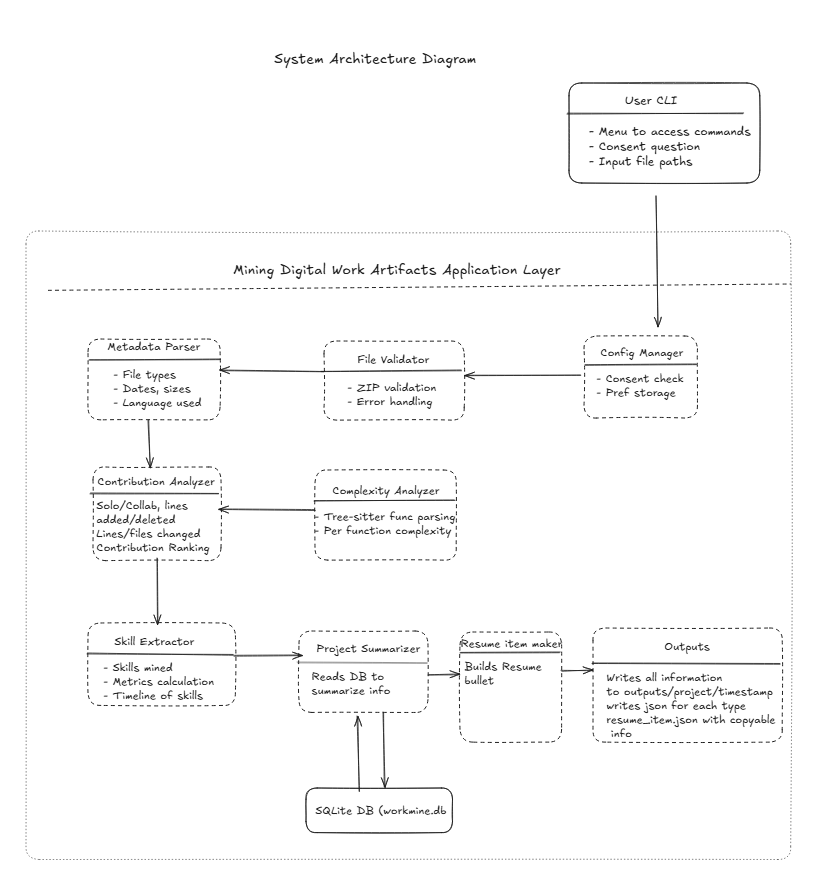
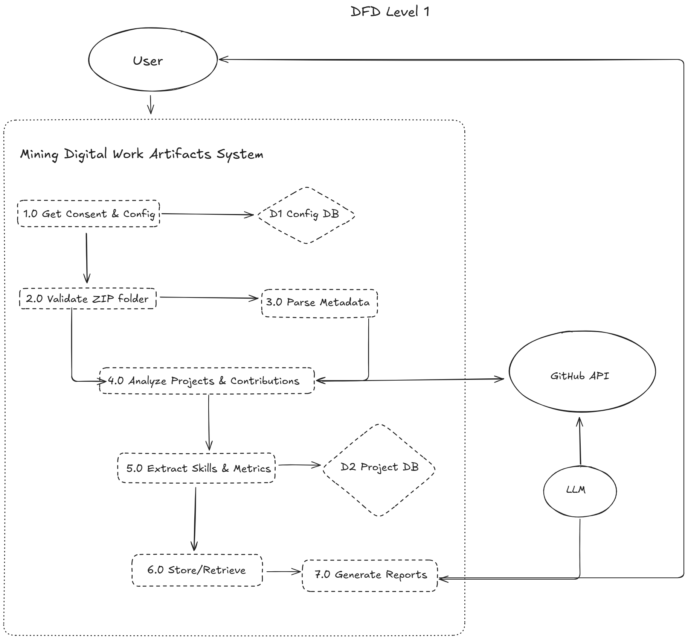

<div align="center">

# 🎓 Capstone Project Team 4

### GitHub Repository Code Analyzer & Resume Builder

[](https://classroom.github.com/online_ide?assignment_repo_id=20510500&assignment_repo_type=AssignmentRepo)

*A powerful CLI tool for analyzing GitHub repositories and generating professional resume items from your code contributions*

---

</div>

## 👥 Team Members

| Name | Student ID | GitHub |
|------|------------|--------|
| Jaiden Lo | 93978203 | [@jaiden](https://github.com/jaiden) |
| Takumi Choi | 37325289 | [@takumi](https://github.com/takumi) |
| Anilov Laxina | 36694933 | [@anilov](https://github.com/anilov) |
| Kussh Satija | 80384878 | [@kussh](https://github.com/kussh) |
| Kiichiro Suganuma | 19743749 | [@kiichiro](https://github.com/kiichiro) |
| Aliff Razak | 58423609 | [@aliff](https://github.com/aliff) |

## 📋 Project Overview

This project provides an intelligent code analysis system that scans GitHub repositories, extracts meaningful insights about programming languages, frameworks, code complexity, and individual contributions. It generates structured resume-worthy items that highlight technical skills and project involvement.

### Key Features

- 🔍 **Comprehensive Code Analysis** - Analyzes multiple programming languages and frameworks
- 📊 **Contribution Tracking** - Identifies individual contributions and code patterns
- 🛠️ **Framework Detection** - Automatically detects frameworks and technologies used
- 📝 **Resume Generation** - Creates professional resume items from code contributions
- 🔐 **Privacy-Focused** - Processes data locally with user consent mechanisms
- 🐳 **Docker Support** - Easy deployment with containerization

## 🏗️ System Architecture

<div align="center">



*Figure 1: Overall System Architecture*



*Figure 2: Data Flow Diagram (Level 1)*


*Figure 3: Analysis Pipeline Flow*

</div>

## 🚀 Quick Start

### Prerequisites
- Python 3.11.0
- Git
- Docker (optional)

### Setup
1. **Fork and clone the repository**
   ```bash
   git clone https://github.com/your-username/capstone-project-team-4.git
   cd capstone-project-team-4
   ```

2. **Create a virtual environment**
   ```bash
   python -m venv .venv
   source .venv/bin/activate  
   # On Windows: .venv\Scripts\activate
   ```

3. **Install dependencies**
   ```bash
   pip install -r requirements.txt
   ```

4. **Choose your development method:**
- [Local Development](#local-development) - Direct Python setup
- [Docker Development](#docker-development) - Containerized environment (recommended)

### Local Development
```bash
# Run the main CLI
python -m src.main --help

# Run commands
python -m src.main [OPTIONS] COMMAND [ARGS]...                    

# Run tests
pytest

# Run with coverage
# This command will create HTML report at /htmlcov
pytest --cov=src --cov-report=html


# View coverage report
open htmlcov/index.html

# For windows : start htmlcov/index.html
```

### Docker Development
```bash
# Build and start service
docker compose up --build -d

# Run the main CLI
docker compose exec app python -m src.main --help

# Run commands
docker compose exec app python -m src.main [OPTIONS] COMMAND [ARGS]...  

# Run tests
docker compose exec app pytest

# Run tests with coverage
docker compose exec app pytest --cov=src --cov-report=term-missing

# remove container
docker compose down
```

## 🎯 Core Capabilities

### Language Analysis
- Detects and analyzes code in **15+ programming languages**
- Measures code complexity and quality metrics
- Identifies language-specific patterns and best practices

### Framework Detection
- Automatically identifies web frameworks (React, Vue, Angular, Django, Flask, etc.)
- Detects testing frameworks (Jest, Pytest, JUnit, etc.)
- Recognizes build tools and package managers

### Skill Extraction
- Maps code patterns to technical skills
- Generates skill proficiency assessments
- Creates resume-ready skill descriptions

### Contribution Analysis
- Tracks individual developer contributions
- Analyzes commit patterns and code ownership
- Generates contribution rankings and statistics

## 📖 Documentation

### 📚 Core Documentation
- [📘 CLI Documentation](docs/design/CLI%20Documentation.md) - Complete command reference and usage guide
- [🤝 Contributing Guidelines](.github/CONTRIBUTING.md) - How to contribute to the project
- [📜 Team Contract](docs/contract/CapstoneTeamContract.pdf) - Team agreements and responsibilities
- [📊 Work Breakdown Structure (WBS)](docs/design/WBS.md) - Project planning and task breakdown
- [🏛️ System Architecture](docs/SYSTEM_ARCHITECTURE.md) - Detailed architecture documentation

### 📋 Project Planning
- [💡 Project Proposal](docs/plan/COSC%20499-Team-4-Project-Proposal.md) - Initial project scope and vision
- [📅 Meeting Minutes](docs/minutes/) - Team meeting notes and decisions
- [📝 Individual Logs](docs/logs/) - Weekly individual progress logs
- [👥 Team Logs](docs/logs/Team/) - Weekly team progress logs

### 🔬 Technical Documentation
- [🔄 Alternative Skill Extraction Pipeline](docs/skill_extraction_alternative_pipeline.md)
- [🗺️ Skill Mapping](docs/skill_mapping.md)

## 🛠️ Technology Stack

### Backend
- **Python 3.11.0** - Core application language
- **PyTest** - Testing framework
- **Click** - CLI framework

### DevOps
- **Docker & Docker Compose** - Containerization
- **Git & GitHub** - Version control and CI/CD
- **GitHub Actions** - Automated testing and deployment

### Data Processing
- **JSON/CSV** - Data serialization formats
- **YAML** - Configuration management

## 📊 Project Statistics

```bash
# View project complexity metrics
python -m src.main analyze [REPOSITORY_PATH]

# Generate contribution reports
python -m src.main report --output-dir ./reports

# Extract resume items
python -m src.main resume [REPOSITORY_PATH]
```

## 🧪 Testing

Our project maintains high code quality with comprehensive testing:

```bash
# Run all tests
pytest

# Run with coverage report
pytest --cov=src --cov-report=html

# View detailed coverage
# Windows: start htmlcov/index.html
# Mac/Linux: open htmlcov/index.html
```

## 🤝 Contributing

We welcome contributions! Please see our [Contributing Guidelines](.github/CONTRIBUTING.md) for details on:
- Code style and standards
- Pull request process
- Issue reporting
- Development workflow

## 📄 License

This project is part of COSC 499 Capstone course at the University of British Columbia.

## 🔗 Links

- [📊 Project Board](https://github.com/COSC-499-W2025/capstone-project-team-4/projects)
- [🐛 Issue Tracker](https://github.com/COSC-499-W2025/capstone-project-team-4/issues)
- [🔀 Pull Requests](https://github.com/COSC-499-W2025/capstone-project-team-4/pulls)

---

<div align="center">

**Built with ❤️ by Team 4**

*COSC 499 - Capstone Project 2025*

</div>

