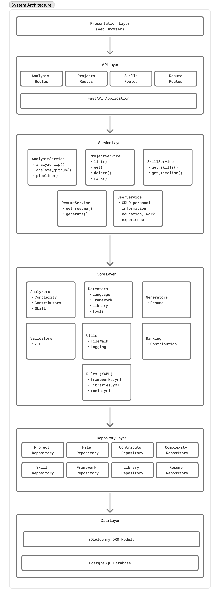

# System Architecture Documentation

This document provides a high-level overview of the system architecture and how the main layers work together. If you are new to the project, start with the “Typical Request Flow” and “Key Code Locations” sections to quickly map concepts to code.

## Design



## Presentation Layer

- Responsible for how data is presented to users and how input is collected
- Displays information (text, tables, charts, UI components)
- Handles user interactions (clicks, forms, typing)
- Formats data (e.g., turning raw data into readable dates, prices, and layouts)
- Web application built with React, Vite, and Tailwind CSS

Think of this layer as the “user experience”: it renders data it receives from the API and sends user actions back to the backend.

## API Layer

Built with FastAPI

- Entry point for all HTTP requests. Handles:
  - Request routing: FastAPI route decorators map URLs to handlers
  - Input validation: Pydantic schemas validate request bodies
  - Authentication: Verifies user credentials
  - Error handling: Converts exceptions to HTTP error responses
  - Response formatting: Serializes data to JSON via Pydantic
- Calls the business/application layer
- Handles errors consistently

This layer does not contain business logic. It translates HTTP requests into calls to services and translates service results into HTTP responses.

## Service Layer

Business logic and orchestration. This is where the “what to do” lives:

- `AnalysisService`: Orchestrates the full analysis pipeline and coordinates analyzers, detectors, and persistence
- `AuthService`: Handles registration and login logic
- `ProjectService`: Project CRUD, contributor deduplication, and domain mapping
- `SkillService`: Skill grouping, timeline queries, and category filtering
- `ResumeService`: Resume generation (AI or template) and retrieval
- `UserProfileService`: Profile and work-experience management

Services are the main entry points for non-trivial operations. If you are unsure where a feature lives, start by searching the service methods.

## Core Layer

Made with Python.
Domain-specific algorithms — the “how to do it”:

Analyzers: Code analysis algorithms

- `complexity.py`: Calculates cyclomatic complexity via Tree-sitter AST
- `contributor.py`: Parses git history and clusters author identities
- `language.py`: Detects languages via file extensions and AST
- `project_stats.py`: Aggregates project-level statistics

Detectors: Technology detection

- `framework.py`: Detects frameworks via YAML rules (import patterns, config files)
- `library.py`: Parses package.json, requirements.txt, pom.xml, etc.
- `tool.py`: Detects dev tools (ESLint, Docker, Webpack) from configs
- `skill.py`: Infers skills from languages, frameworks, and libraries

Generators: Output creation

- `resume.py`: Generates resume bullet points (AI or templates)

Validators: Input verification

- `zip.py`: Validates ZIP archives (size, depth, file count)

Utils: Shared helpers

- `file_walker.py`: Single-pass file traversal with filtering

Rules: YAML configuration for detection patterns

The Core layer is designed to be reusable and largely independent from web concerns. It focuses on algorithms and domain logic.

## Repository Layer

Data-access abstraction.

Instead of writing SQL everywhere:

```
project = db.query(Project).filter(Project.id == id).first()
```

Services call repositories:

```
project = self.project_repo.get(id)
```

- Single responsibility: All queries for an entity in one place
- Testability: Easy to mock for unit tests
- Flexibility: Can swap databases without changing services
- Consistency: Standard CRUD interface across all entities

Each repository handles one entity type (Project, Skill, Contributor, etc.).

## Data Layer

Uses PostgreSQL.

- `database.py`: SQLAlchemy engine, session factory, connection pooling
- `orm/*.py`: SQLAlchemy model classes (tables → Python objects)
- `schemas/*.py`: Pydantic models for API request/response validation

SQLAlchemy is the Object-Relational Mapper (ORM) used in this project. It maps database tables to Python classes and provides a session-based API for querying and persisting data. Repositories use SQLAlchemy sessions to perform CRUD operations without writing raw SQL in most cases.

## Typical Request Flow

1. A user action in the UI triggers a request to the backend.
2. The API layer validates input and authenticates the user.
3. A service method orchestrates the work (e.g., analysis, project updates, resume generation).
4. The service calls repositories to read/write data, and core modules to run algorithms.
5. The API layer serializes the result into a response for the frontend.

This flow helps you decide where to place new logic: UI concerns stay in the frontend, orchestration lives in services, and reusable algorithms belong in core.

## Key Code Locations

- `backend/src/api/`: FastAPI routes and request/response schemas
- `backend/src/services/`: Business logic and orchestration
- `backend/src/core/`: Algorithms, analyzers, and detectors
- `backend/src/repositories/`: Database access layer
- `backend/src/models/`: SQLAlchemy ORM models
- `backend/src/data/`: Data access utilities and persistence helpers
- `backend/src/utils/`: Shared helpers and utilities
